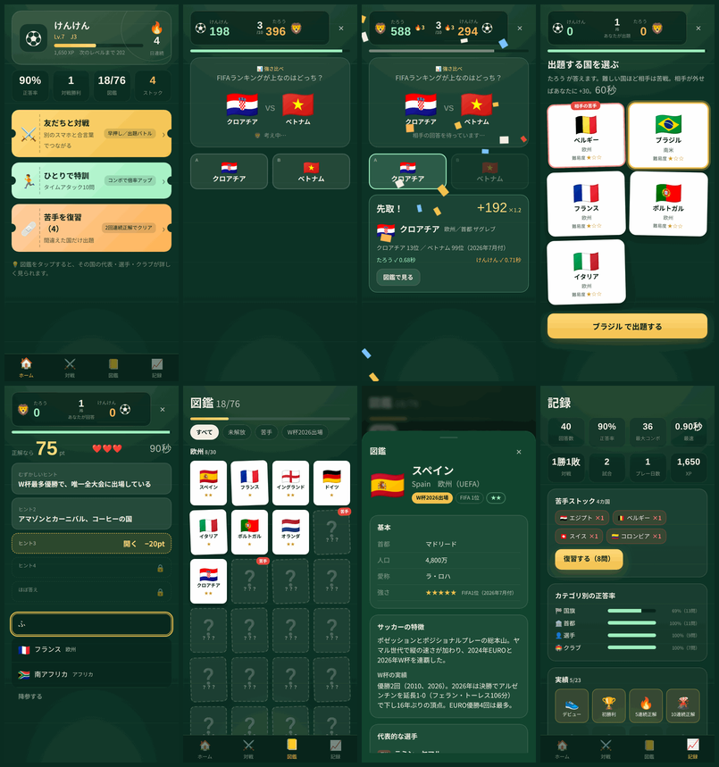

# クニマスター（KuniMaster）

**▶ 今すぐ遊ぶ：https://ketrketr2.github.io/kuni-master/**　（スマホのブラウザで開く。「ホーム画面に追加」でアプリとして動く）

別々のスマホで同時に遊べる、国名当てクイズ。国旗・首都・サッカー選手・クラブ・代表の強さから国を当てる。サーバー不要（WebRTCでスマホ同士が直接つながる）、インストール不要（PWA）、GitHub Pagesにそのまま置ける。



## 遊び方

| モード | 内容 |
| --- | --- |
| ⚡ 早押しバトル（2台） | 同じ問題に同時回答。速いほど高得点（100 + 速さボーナス最大100）。2番手の正解は半分。ヒントを開くと −20 / −30。3連続正解から倍率 ×1.2 → ×1.5（5連続）→ ×2.0（8連続） |
| 🃏 出題バトル（2台 / 1台交互） | 交互に出題。出題者は配られた5枚の手札（相手の「苦手」カードを含む）から国を選ぶ。回答者は100点スタートでヒントを開くたびに減点（−10 / −15 / −20 / −25 / −20）、誤答は −15、3回ミスで失敗。相手が外すと出題者に +30 |
| 🏃 ひとりで特訓 | タイムアタック5〜20問。問題数・難易度・カテゴリを選べる |
| 🩹 苦手を復習 | 間違えた国は「ストック」に溜まり、2回連続で正解するとクリア |

出題タイプは8種類：国旗 / 首都 / 選手 / クラブ / 強さ比べ（FIFAランキング）/ 代表の愛称 / レジェンド / 特徴。

### 2台で対戦する手順

1. どちらかが **対戦 → 部屋をつくる**。6文字の合言葉とQRコードが出る。
2. もう一人が **部屋に入る** に合言葉を入力（または招待リンク / QRを開くと自動で合流）。
3. ゲストが **準備OK**、ホストが **キックオフ**。ホストが問題数・難易度・カテゴリを決める。
4. 試合後は「もう一回」で再戦。同じ相手との勝敗は「記録 → ライバル戦績」に残る。

通信は PeerJS（WebRTC DataChannel）。同じWi-Fiでも別回線でも動く。NATが厳しい回線向けにTURNフォールバック（Open Relay）を設定済み。ホストがブラウザを閉じると部屋は消える。

## ハマる仕組み

- **XPとレベル**：得点の半分 + 勝利ボーナスがXPに。称号は 街クラブ → ユース → J3 → J2 → J1 → ACL常連 → CL出場 → CL王者 → バロンドール級 → 殿堂入り
- **図鑑（ステッカーアルバム）**：正解した国が解放され、正解数で★が増える。76カ国コンプリートが最終目標
- **苦手ストック**：間違えた国だけを復習。出題バトルでは相手の苦手カードを狙って出題できる
- **実績23種**：電光石火（0.8秒以内）、10連続正解、欧州制覇、1週間皆勤 など
- **記録**：全回答の履歴（600件）、カテゴリ別正答率、最速タイム、ライバル戦績。JSONで書き出し / 読み込み可
- **連続プレー日数**、コンボ演出、紙吹雪、効果音（WebAudio合成）、振動

## 図鑑の中身

76カ国（欧州30 / 南米10 / 北中米8 / アフリカ13 / アジア14 / オセアニア1）。各国について：

- FIFAランキング（**2026年7月20日付**）と5段階の強さ
- 代表の愛称・スタイル・W杯の実績（**W杯2026の結果を反映**：スペイン優勝、日本はラウンド32敗退 など）
- 代表的な選手（ポジション・所属・特徴）とレジェンド
- 国内リーグと主要クラブ、豆知識
- 出題バトル用のヒント5段階（難 → 易）

所属クラブは2026年夏時点。移籍で変わることがある。データは `js/data-*.js` にあり、1カ国1オブジェクトなので追加・修正は簡単。

## 公開する（GitHub Pages）

1コマンド（`gh` CLI が入っている Mac なら）：

```bash
bash publish.sh          # リポジトリ作成 → push → Pages 有効化 → 公開URLを表示
```

手動なら：

```bash
git clone <このリポジトリ> && cd kuni-master   # または zip を展開
git remote add origin https://github.com/<user>/kuni-master.git
git push -u origin main
```

GitHub の **Settings → Pages → Build and deployment → Source** を **GitHub Actions** にすると、`.github/workflows/pages.yml` が push のたびにデプロイする。`https://<user>.github.io/kuni-master/` で開ける。

「Deploy from a branch（main / root）」でも動く。ビルド工程はない（静的ファイルのみ）。

スマホでは「ホーム画面に追加」でフルスクリーンのアプリとして動く（PWA）。

## ローカルで動かす

```bash
python3 -m http.server 8000     # http://localhost:8000/
```

同じPCの2タブで通信を試すなら `?net=bc`（BroadcastChannel）を付ける：`http://localhost:8000/?net=bc` で部屋を作り、もう1タブで合流。

## テスト

```bash
node test/engine.test.js        # 出題生成・採点エンジン・ストア（DOM不要）
python3 test/e2e.py             # Playwright: オンボーディング → ソロ → 2画面の早押し/出題バトル → 1台交互 → 設定
```

## 技術構成

- 依存ライブラリなしの素の HTML / CSS / JavaScript（ビルド不要、`file://` でも動く）
- 通信：[PeerJS](https://peerjs.com/) 1.5（CDN）。ホストが正となる設計。ホスト側のエンジンが状態を持ち、ゲストは入力を送って画面状態を受け取る
- 保存：`localStorage`（端末内のみ。サーバーには何も送らない）
- PWA：`manifest.webmanifest` + `sw.js`（アプリシェルをキャッシュ）
- フォント：BIZ UDPGothic / Bebas Neue（Google Fonts）

```
index.html          画面の骨組み・スクリプト読み込み順
css/app.css         デザインシステム（ナイトピッチ × ステッカーアルバム）
js/data-*.js        76カ国のデータ
js/util.js          DOMヘルパー・乱数・効果音・振動・紙吹雪
js/store.js         永続化・XP/レベル・実績・ストック・履歴
js/quiz.js          出題生成（8タイプ）・検索・出題バトルの手札
js/engine.js        SpeedEngine / TurnEngine（ホスト権威の状態機械）
js/net.js           PeerJS / BroadcastChannel トランスポート
js/ui.js            ホーム・対戦ロビー・図鑑・記録・設定
js/game-ui.js       試合画面・結果画面
js/app.js           画面遷移・セッション管理・通信プロトコル
```

## ライセンス

MIT。国名・選手名・クラブ名などの固有名詞は各権利者に帰属する事実情報として収録している。
